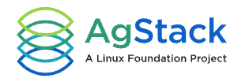
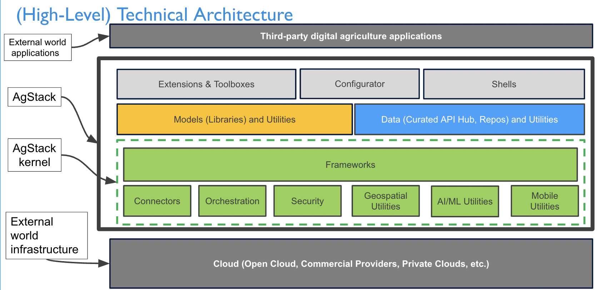

# AgStack 

### About 

This repository hosts the website code for the AgStack Foundation project (`agstack`). This Linux Foundation project is an operating system for food and agriculture applications run by members and users. Access software infrastructure like tools, frameworks, and models that are needed to build, manage, and run applications through open source. 

## Architectural overview

AgStack is an open source digital infrastructure for agricultural ecosystems. Use the AgStack     project to create, publish and use agronomically-relevant software and data. The following components comprise the AgStack architecture: 

* Frameworks
* Models
* Extensions and toolboxes, and
* Data (hosted web services, Digital Public Goods (DPG), etc).

View the following diagram:

### Technical architecture

## Projects
<!--descriptions need to be revised-->
There are independent projects within the AgStack projects, and more can be added depending on community participation. View the following table list of the projects within AgStack:

|            |              |            |
|------------|-------------|-----------|
| **Project/repository** | **Description** | **Type** |
| [`ag-rec`](https://github.com/agstack/ag-rec) | {::nomarkdown}Simple recommendation repository for publishing and subscribing to agricultural recommendations. | Hosted web service |
| [`asset-registry`](https://github.com/agstack/asset-registry) | API and Map F/E for registering and querying field boundaries. Returns a value for your geographical identification for a unique geo-boundary. | Hosted web service|
| [`user-registry`](https://github.com/agstack/user-registry) | API for registering a user and getting (via email / OTP) a public and a private set of credentials that are be used for all `ag-stack` projects | Hosted web service |
| [`MessageCast`](https://github.com/agstack/MessageCast) | Mobile websockets asynchronous message bus that allows users to publish and subscribe messages on a “topic” (which is a channel) [including using forms - see form-hub]. Importantly, all images | Software framework |

<!--consider creating another repository or folder for the community to contribute-->
<!--## Prerequisites

- [GitHub account](https://github.com/)
- [Retrieve your Git keys](https://docs.github.com/en/authentication/connecting-to-github-with-ssh/checking-for-existing-ssh-keys)

## Maintaining

You can make changes to the content on the website by editing the Markdown files in the `_pages` folder. You can also add new topics and tabs to the website using Markdown files. GitHub Pages will automatically update the site when changes are detected in the repository.

## Deployment

This website is already deployed using [GitHub Pages](https://pages.github.com/). No further deployment is needed. If you do need to deploy the website again, see the following instructions:

## Website
1. Rename your repository to `<your-github-username>.github.io` or `<your-github-orgname>.github.io`.
2. In `_config.yml`, set `url` to `https://<your-github-username>.github.io` and leave `baseurl` empty.
3. Set up automatic deployment of your webpage.
4. Make changes, commit, and push.
5. After deployment, the website becomes available at `<your-github-username>.github.io`.

## Projects
1. In `_config.yml`, set `url` to `https://<your-github-username>.github.io` and `baseurl` to `/<your-repository-name>/`.
2. Set up automatic deployment of your webpage.
3. Make changes, commit, and push.
4. After deployment, the webpage becomes available at `<your-github-username>.github.io/<your-repository-name>/`.-->

## Licenses

* [Apache 2.0](https://www.apache.org/licenses/)
* [Community Data License 2.0](https://cdla.dev/permissive-2-0/)

